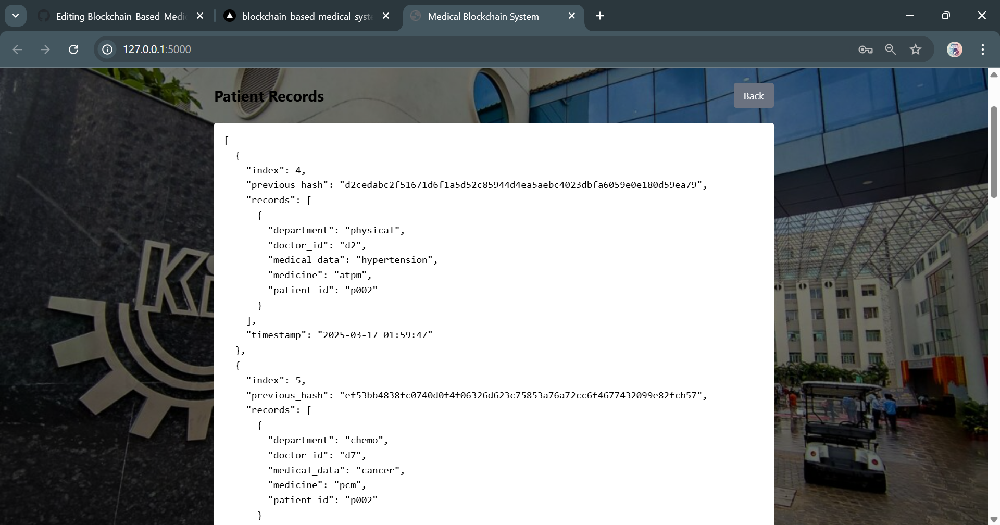

# Blockchain-Based Medical Record System

## Overview

This project is a **Blockchain-Based Medical Record System** that leverages **PBFT (Practical Byzantine Fault Tolerance) consensus** to securely store and validate medical records. It features a **role-based access control system** for doctors, patients, pharmacies, and departments.

The system includes:

- **Frontend**: A Tailwind CSS-based responsive UI for role-based access and interactions.
- **Backend**: A Flask API that handles authentication, blockchain operations, and data storage using SQLite.
- **Blockchain Implementation**: PBFT-based consensus mechanism to ensure data integrity and trust.

## Features

- **Decentralized Medical Record Storage**: Ensures that patient data is securely stored and tamper-proof.
- **Role-Based Access Control**: Users are assigned roles (Doctor, Patient, Pharmacy, Department) with different permissions.
- **Authentication & Authorization**: Secure login system with JWT-based authentication.
- **Consensus Algorithm**: Implements PBFT for verifying and adding records to the blockchain.
- **Real-Time Transaction Metrics**: Logs throughput (TPS), latency, success rate, and energy consumption.
- **User-Friendly Interface**: Designed with Tailwind CSS for an intuitive user experience.

## Technologies Used

### **Frontend**

- **HTML, CSS (Tailwind CSS)**: For UI and responsive design.
- **JavaScript**: For client-side logic and API calls.

### **Backend**

- **Flask**: A Python-based web framework for handling API requests.
- **SQLite**: Lightweight database for storing blockchain records.
- **PBFT Consensus**: Ensures secure and efficient data validation.
- **CORS & JSON Handling**: Enables cross-origin requests and JSON-based communication.

## Installation & Setup

### **Prerequisites**

Make sure you have the following installed:

- Python (>= 3.8)
- Node.js (for frontend development)
- SQLite (for database operations)

### **Backend Setup**

1. Clone the repository:

2. Create a virtual environment and activate it:

3. Install dependencies:

4. Run the Flask backend:

   The backend will run on `http://localhost:5000`.

### **Frontend Setup**

1. Navigate to the `frontend` directory:

2. Start a local server:

   The frontend will run on `http://localhost:3000`.

## API Endpoints

### **Authentication**

- `POST /login` - Logs in users based on role.

### **Medical Records**

- `POST /add_record` - Adds a medical record (Doctor role required).
- `POST /validate_block` - Runs PBFT consensus and adds a block.
- `POST /get_chain` - Retrieves patient records stored on the blockchain.

## Role-Based Dashboard

### **Doctor Dashboard**

- Add Medical Records
- Validate and Add Blocks
- View Patient Records

### **Patient Dashboard**

- View Own Medical Records

## PBFT Consensus Mechanism

1. **Record Submission**: Doctor submits a medical record.
2. **Candidate Block Creation**: A new block is generated with pending records.
3. **Validator Voting**: A set of validators vote on the legitimacy of the block.
4. **Finalization**: If 2/3 majority approves, the block is added to the blockchain.

## Performance Metrics

The system logs the following performance metrics:

- **Latency** (Time taken to validate and add a block).
- **Transactions per Second (TPS)**.
- **Energy Consumption** (Estimated in Joules).
- **Success Rate** (Percentage of successful block additions).
- **Efficiency** (TPS/Energy used).

  ## Screenshots  

### Login Page  
  

### Dashboard
  

### Add the medical record 
  

### Validation Of Patient By Its Credentials   
  

### Records Management  
  

## Future Enhancements

- **Implement IPFS for Decentralized Storage**.
- **Enhance UI with React.js**.
- **Integrate AI-based Anomaly Detection for Records**.
- **Implement Multi-Signature Authentication**.

  ## Contact
     NishantChaubey534
     chaubeynishant2@gmail.com

## License

This project is licensed under the MIT License.

